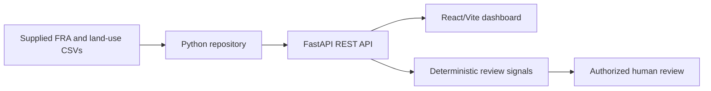

# Architecture

The current implementation is a read-only, file-backed vertical slice. React/Vite consumes FastAPI endpoints; FastAPI parses the supplied CSVs through a repository layer and applies transparent operational rules. No LLM, generative model, autonomous legal decision, or new database is created.

Future claim-level services should add PostgreSQL/PostGIS only when the teammate supplies the authoritative schema and connection details. Analytical outputs should use a shared evidence object with source, acquisition date, method, provenance, limitations, and verification status.

## Foundation

`app/config.py` supplies environment-only settings. In `DATABASE_MODE=demo`, no SQLAlchemy engine is created and the deterministic in-memory repository is used. In `DATABASE_MODE=postgres`, `app/database.py` provides a SQLAlchemy engine/session dependency and mapped tables in `app/models`. The models retain GeoJSON in EPSG:4326-compatible JSON fields so API contracts are portable; a production PostGIS deployment can substitute GeoAlchemy/PostGIS geometry columns without changing the public GeoJSON API.
